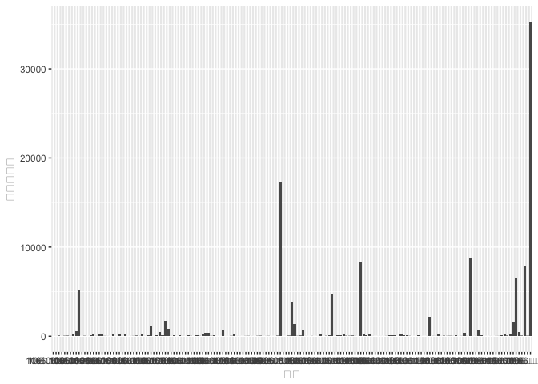
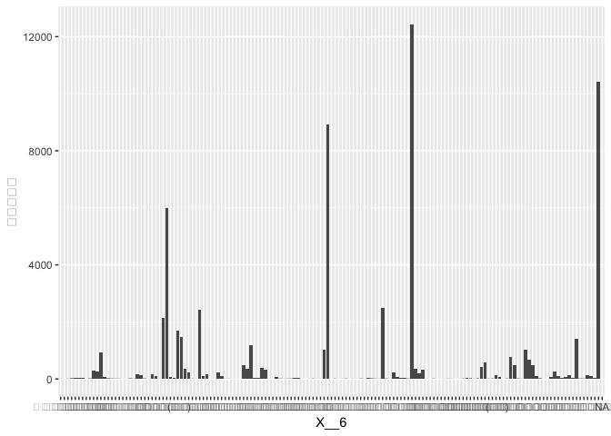

106-2 大數據分析方法 作業二
================
蕭睿甫

作業完整說明[連結](https://docs.google.com/document/d/1aLGSsGXhgOVgwzSg9JdaNz2qGPQJSoupDAQownkGf_I/edit?usp=sharing)

學習再也不限定在自己出生的國家，台灣每年有許多學生選擇就讀國外的大專院校，同時也有人多國外的學生來台灣就讀，透過分析[大專校院境外學生人數統計](https://data.gov.tw/dataset/6289)、[大專校院本國學生出國進修交流數](https://data.gov.tw/dataset/24730)、[世界各主要國家之我國留學生人數統計表](https://ws.moe.edu.tw/Download.ashx?u=C099358C81D4876CC7586B178A6BD6D5062C39FB76BDE7EC7685C1A3C0846BCDD2B4F4C2FE907C3E7E96F97D24487065577A728C59D4D9A4ECDFF432EA5A114C8B01E4AFECC637696DE4DAECA03BB417&n=4E402A02CE6F0B6C1B3C7E89FDA1FAD0B5DDFA6F3DA74E2DA06AE927F09433CFBC07A1910C169A1845D8EB78BD7D60D7414F74617F2A6B71DC86D17C9DA3781394EF5794EEA7363C&icon=..csv)可以了解103年以後各大專院校國際交流的情形。請同學分析以下議題，並以視覺化的方式呈現分析結果，呈現103年以後大專院校國際交流的情形。

來台境外生分析
--------------

### 資料匯入與處理

``` r
library(readr)
library(readxl)
library(dplyr)
```

    ## 
    ## Attaching package: 'dplyr'

    ## The following objects are masked from 'package:stats':
    ## 
    ##     filter, lag

    ## The following objects are masked from 'package:base':
    ## 
    ##     intersect, setdiff, setequal, union

``` r
library(ggplot2) 
othreec<- read_csv("~/Downloads/103_ab103_C.csv")
```

    ## Parsed with column specification:
    ## cols(
    ##   洲別 = col_character(),
    ##   國別 = col_character(),
    ##   `學位生-正式修讀學位外國生` = col_integer(),
    ##   `學位生-僑生(含港澳)` = col_integer(),
    ##   `學位生-正式修讀學位陸生` = col_integer(),
    ##   `非學位生-外國交換生` = col_integer(),
    ##   `非學位生-外國短期研習及個人選讀` = col_integer(),
    ##   `非學位生-大專附設華語文中心學生` = col_integer(),
    ##   `非學位生-大陸研修生` = col_integer(),
    ##   `非學位生-海青班` = col_integer(),
    ##   境外專班 = col_integer()
    ## )

``` r
ofourc<- read_csv("~/Downloads/104_ab104_C.csv")
```

    ## Parsed with column specification:
    ## cols(
    ##   洲別 = col_character(),
    ##   國別 = col_character(),
    ##   `學位生-正式修讀學位外國生` = col_integer(),
    ##   `學位生-僑生(含港澳)` = col_integer(),
    ##   `學位生-正式修讀學位陸生` = col_integer(),
    ##   `非學位生-外國交換生` = col_integer(),
    ##   `非學位生-外國短期研習及個人選讀` = col_integer(),
    ##   `非學位生-大專附設華語文中心學生` = col_integer(),
    ##   `非學位生-大陸研修生` = col_integer(),
    ##   `非學位生-海青班` = col_integer(),
    ##   境外專班 = col_integer()
    ## )

``` r
ofivec<- read_csv("~/Downloads/105_ab105_C.csv")
```

    ## Parsed with column specification:
    ## cols(
    ##   洲別 = col_character(),
    ##   國別 = col_character(),
    ##   學位生_正式修讀學位外國生 = col_integer(),
    ##   `學位生_僑生(含港澳)` = col_integer(),
    ##   學位生_正式修讀學位陸生 = col_integer(),
    ##   非學位生_外國交換生 = col_integer(),
    ##   非學位生_外國短期研習及個人選讀 = col_integer(),
    ##   非學位生_大專附設華語文中心學生 = col_integer(),
    ##   非學位生_大陸研修生 = col_integer(),
    ##   非學位生_海青班 = col_integer(),
    ##   境外專班 = col_integer()
    ## )

``` r
osixc<- read_csv("~/Downloads/106_ab105_C.csv")    #以國為分類
```

    ## Parsed with column specification:
    ## cols(
    ##   洲別 = col_character(),
    ##   國別 = col_character(),
    ##   學位生_正式修讀學位外國生 = col_integer(),
    ##   `學位生_僑生(含港澳)` = col_integer(),
    ##   學位生_正式修讀學位陸生 = col_integer(),
    ##   非學位生_外國交換生 = col_integer(),
    ##   非學位生_外國短期研習及個人選讀 = col_integer(),
    ##   非學位生_大專附設華語文中心學生 = col_integer(),
    ##   非學位生_大陸研修生 = col_integer(),
    ##   非學位生_海青班 = col_integer(),
    ##   境外專班 = col_integer()
    ## )

``` r
othrees<- read_csv("~/Downloads/103_ab103_S.csv")
```

    ## Parsed with column specification:
    ## cols(
    ##   學校類型 = col_character(),
    ##   學校代碼 = col_character(),
    ##   學校名稱 = col_character(),
    ##   `學位生-正式修讀學位外國生` = col_integer(),
    ##   `學位生-僑生(含港澳)` = col_integer(),
    ##   `學位生-正式修讀學位陸生` = col_integer(),
    ##   `非學位生-外國交換生` = col_integer(),
    ##   `非學位生-外國短期研習及個人選讀` = col_integer(),
    ##   `非學位生-大專附設華語文中心學生` = col_integer(),
    ##   `非學位生-大陸研修生` = col_character(),
    ##   `非學位生-海青班` = col_integer(),
    ##   境外專班 = col_integer()
    ## )

``` r
ofours<- read_csv("~/Downloads/104_ab104_S.csv")
```

    ## Parsed with column specification:
    ## cols(
    ##   學校類型 = col_character(),
    ##   學校代碼 = col_character(),
    ##   學校名稱 = col_character(),
    ##   `學位生-正式修讀學位外國生` = col_integer(),
    ##   `學位生-僑生(含港澳)` = col_integer(),
    ##   `學位生-正式修讀學位陸生` = col_integer(),
    ##   `非學位生-外國交換生` = col_integer(),
    ##   `非學位生-外國短期研習及個人選讀` = col_integer(),
    ##   `非學位生-大專附設華語文中心學生` = col_integer(),
    ##   `非學位生-大陸研修生` = col_character(),
    ##   `非學位生-海青班` = col_integer(),
    ##   境外專班 = col_integer()
    ## )

``` r
ofives<- read_csv("~/Downloads/105_ab105_S.csv")
```

    ## Parsed with column specification:
    ## cols(
    ##   學校類型 = col_character(),
    ##   學校代碼 = col_character(),
    ##   學校名稱 = col_character(),
    ##   學位生_正式修讀學位外國生 = col_integer(),
    ##   `學位生_僑生(含港澳)` = col_integer(),
    ##   學位生_正式修讀學位陸生 = col_integer(),
    ##   非學位生_外國交換生 = col_integer(),
    ##   非學位生_外國短期研習及個人選讀 = col_integer(),
    ##   非學位生_大專附設華語文中心學生 = col_integer(),
    ##   非學位生_大陸研修生 = col_integer(),
    ##   非學位生_海青班 = col_integer(),
    ##   境外專班 = col_integer()
    ## )

``` r
osixs<- read_csv("~/Downloads/106_ab105_S.csv")    #以校為分類
```

    ## Parsed with column specification:
    ## cols(
    ##   學校類型 = col_character(),
    ##   學校代碼 = col_character(),
    ##   學校名稱 = col_character(),
    ##   學位生_正式修讀學位外國生 = col_integer(),
    ##   `學位生_僑生(含港澳)` = col_integer(),
    ##   學位生_正式修讀學位陸生 = col_integer(),
    ##   非學位生_外國交換生 = col_integer(),
    ##   非學位生_外國短期研習及個人選讀 = col_integer(),
    ##   非學位生_大專附設華語文中心學生 = col_integer(),
    ##   非學位生_大陸研修生 = col_integer(),
    ##   非學位生_海青班 = col_integer(),
    ##   境外專班 = col_integer()
    ## )

### 哪些國家來台灣唸書的學生最多呢？

``` r
othreec$在台學生數<-othreec$`學位生-正式修讀學位外國生`+othreec$`學位生-僑生(含港澳)`+othreec$`學位生-正式修讀學位陸生`+othreec$`非學位生-外國交換生`+othreec$`非學位生-外國短期研習及個人選讀`+othreec$`非學位生-大專附設華語文中心學生`+othreec$`非學位生-大陸研修生`+othreec$`非學位生-海青班`+othreec$境外專班
ofourc$在台學生數<-ofourc$`學位生-正式修讀學位外國生`+ofourc$`學位生-僑生(含港澳)`+ofourc$`學位生-正式修讀學位陸生`+ofourc$`非學位生-外國交換生`+ofourc$`非學位生-外國短期研習及個人選讀`+ofourc$`非學位生-大專附設華語文中心學生`+ofourc$`非學位生-大陸研修生`+ofourc$`非學位生-海青班`+ofourc$境外專班
ofivec$在台學生數<-ofivec$學位生_正式修讀學位外國生+ofivec$`學位生_僑生(含港澳)`+ofivec$學位生_正式修讀學位陸生+ofivec$非學位生_外國交換生+ofivec$非學位生_外國短期研習及個人選讀+ofivec$非學位生_大專附設華語文中心學生+ofivec$非學位生_大陸研修生+ofivec$非學位生_海青班+ofivec$境外專班
osixc$在台學生數<-osixc$學位生_正式修讀學位外國生+osixc$`學位生_僑生(含港澳)`+osixc$學位生_正式修讀學位陸生+osixc$非學位生_外國交換生+osixc$非學位生_外國短期研習及個人選讀+osixc$非學位生_大專附設華語文中心學生+osixc$非學位生_大陸研修生+osixc$非學位生_海青班+osixc$境外專班
osixcc<-osixc[,c(1,2,12)]#之後會用到
names(ofourc)<-names(ofivec)
names(othreec)<-names(ofivec)
osixc$國別<-paste("106", osixc$國別, sep='')
ofivec$國別<-paste("105", ofivec$國別, sep='')
ofourc$國別<-paste("104", ofourc$國別, sep='')
othreec$國別<-paste("103", othreec$國別, sep='')
seaoverc<-rbind(othreec,ofourc,ofivec,osixc)
head(seaoverc[order(seaoverc$在台學生數,decreasing = T),c(2,12)],15)
```

    ## # A tibble: 15 x 2
    ##    國別        在台學生數
    ##    <chr>            <int>
    ##  1 105中國大陸      41981
    ##  2 104中國大陸      41951
    ##  3 106中國大陸      35304
    ##  4 103中國大陸      33288
    ##  5 106馬來西亞      17281
    ##  6 105馬來西亞      16311
    ##  7 104馬來西亞      15054
    ##  8 103馬來西亞      13385
    ##  9 106香港           8761
    ## 10 105香港           8660
    ## 11 106日本           8387
    ## 12 104香港           8233
    ## 13 106越南           7864
    ## 14 105日本           7542
    ## 15 104日本           6455

``` r
#以103年到106年的資料看起來中國大陸的留台學生是不容置疑的多
#馬來西亞落座於長年第二，香港和日本持續追逐第三和第四，值得一提的是越南在106年度大幅提高了留學的人數
```

### 哪間大學的境外生最多呢？

``` r
names(ofours)<-names(ofives)
names(othrees)<-names(ofives)
#統一column名字解決-與＿的不同
othrees$外國學生數 <-othrees$`學位生_正式修讀學位外國生`+othrees$`學位生_僑生(含港澳)`+othrees$`學位生_正式修讀學位陸生`+othrees$`非學位生_外國交換生`+othrees$`非學位生_外國短期研習及個人選讀`+othrees$`非學位生_大專附設華語文中心學生`+othrees$`非學位生_海青班`+othrees$境外專班
ofours$外國學生數 <-ofours$`學位生_正式修讀學位外國生`+ofours$`學位生_僑生(含港澳)`+ofours$`學位生_正式修讀學位陸生`+ofours$`非學位生_外國交換生`+ofours$`非學位生_外國短期研習及個人選讀`+ofours$`非學位生_大專附設華語文中心學生`+ofours$`非學位生_海青班`+ofours$境外專班
ofives$外國學生數 <-ofives$學位生_正式修讀學位外國生+ofives$`學位生_僑生(含港澳)`+ofives$學位生_正式修讀學位陸生+ofives$非學位生_外國交換生+ofives$非學位生_外國短期研習及個人選讀+ofives$非學位生_大專附設華語文中心學生+ofives$非學位生_海青班+ofives$境外專班
osixs$外國學生數 <-osixs$學位生_正式修讀學位外國生+osixs$`學位生_僑生(含港澳)`+osixs$學位生_正式修讀學位陸生+osixs$非學位生_外國交換生+osixs$非學位生_外國短期研習及個人選讀+osixs$非學位生_大專附設華語文中心學生+osixs$非學位生_海青班+osixs$境外專班
#subset(osixs,osixs$非學位生_大陸研修生!=0)
#subset(ofives,ofives$非學位生_大陸研修生!=0)
#subset(ofours,ofours$非學位生_大陸研修生!=0)
#subset(othrees,othrees$非學位生_大陸研修生!=0)
#因“非學位生_大陸研修生”此欄位具有數值的列均指向 “9999 無法區分校別”故不列入計算範圍
osixs$學校名稱<-paste("106", osixs$學校名稱, sep='')
ofives$學校名稱<-paste("105", ofives$學校名稱, sep='')
ofours$學校名稱<-paste("104", ofours$學校名稱, sep='')
othrees$學校名稱<-paste("103", othrees$學校名稱, sep='')
#因為是103-106年加總加上學校年度較好辨識
seaoverst<-rbind(othrees,ofours,ofives,osixs)
head(seaoverst[order(seaoverst$外國學生數,decreasing = T),c(3,13)],10)
```

    ## # A tibble: 10 x 2
    ##    學校名稱            外國學生數
    ##    <chr>                    <int>
    ##  1 106國立臺灣師範大學       6428
    ##  2 105國立臺灣師範大學       5709
    ##  3 104國立臺灣師範大學       5328
    ##  4 106國立臺灣大學           5068
    ##  5 105國立臺灣大學           4817
    ##  6 103國立臺灣師範大學       4648
    ##  7 104國立臺灣大學           4514
    ##  8 106銘傳大學               4294
    ##  9 104中國文化大學           4188
    ## 10 105銘傳大學               4159

``` r
#台灣境外生最多的學校是台灣師範大學
#其次即是台灣大學
#而文化和銘傳長年角逐第三第四名
```

### 各個國家來台灣唸書的學生人數條狀圖

``` r
ggplot() +geom_bar(data=osixc, aes(x =國別 , y =在台學生數), stat = "identity")
```



### 各個國家來台灣唸書的學生人數面量圖

``` r
#這是R Code Chunk
```

台灣學生國際交流分析
--------------------

### 資料匯入與處理

``` r
library(readxl)
alltoo <- read_excel("~/Downloads/kqxrv-7g4lo.xls", 
                          skip = 2)
```

    ## Warning in read_fun(path = path, sheet = sheet, limits = limits, shim =
    ## shim, : Expecting numeric in A35025 / R35025C1: got '統計說明：'

    ## Warning in read_fun(path = path, sheet = sheet, limits = limits, shim =
    ## shim, : Expecting numeric in A35026 / R35026C1: got '1. 本表設立別係指【公
    ## 立、私立】大學校院等分類；學校類別係指【一般大學、技專校院】等；學校名稱係
    ## 指【學校校名】；系所名稱係指【學校系、所、學位學程之名稱】。'

    ## Warning in read_fun(path = path, sheet = sheet, limits = limits, shim =
    ## shim, : Expecting numeric in A35027 / R35027C1: got '2. 本表「學制」係指
    ## 【二專(日間)、二專(進修)、五專、學士班(日間)、學士班(進修)、碩士班(日間)、
    ## 碩士在職專班、博士班】；其中學士班(日間)及學士班(進修)包含大學四年制(或四
    ## 技)、大學二年制(或二技)及學士後第二專長學士班。'

    ## Warning in read_fun(path = path, sheet = sheet, limits = limits, shim =
    ## shim, : Expecting numeric in A35028 / R35028C1: got '3. 本表「對方學校（機
    ## 構）國別(地區)」係指本國學生出國進修、交流之對方學校（機構）之國家（地區）
    ## 別。'

    ## Warning in read_fun(path = path, sheet = sheet, limits = limits, shim =
    ## shim, : Expecting numeric in A35029 / R35029C1: got '4. 本表「對方學校
    ## (機構)名稱」係指對方學校(機構)之中、英文名稱；例如：早稻田大學、Waseda
    ## University。'

    ## Warning in read_fun(path = path, sheet = sheet, limits = limits, shim =
    ## shim, : Expecting numeric in A35030 / R35030C1: got '5. 本表「本國學生出國
    ## 進修、交流人數」係指本國學生出國進修、交流之【男；女】人數，亦即學生若獲得
    ## 「行政院科技部補助博士生赴國外研究補助」、「跨國產學合作交流及專業人才培訓
    ## 計畫補助」、「學海飛颺」、「學海惜珠」或其他計畫經費補助出國進修、交流者，
    ## 不包括出國參與競賽交流、進行實習或雙聯學制者。'

    ## Warning in read_fun(path = path, sheet = sheet, limits = limits, shim = shim, : Expecting numeric in A35031 / R35031C1: got '6. 本表出國進修、交流期間包含以下類型(不含雙聯學制)：
    ## (1) 就讀一學年(含)以上(修讀學分者)。
    ## (2)就讀一學年(含)以上(未修讀學分者)。
    ## (3)就讀一學期(含)以上未滿一學年(修讀學分者)。
    ## (4)就讀一學期(含)以上未滿一學年(未修讀學分者)。
    ## (5)超過2個月(含)以上，但未滿一學期者(修讀學分者)。 
    ## (6)超過2個月(含)以上，但未滿一學期者(未修讀學分者)。
    ## (7)校方正式簽訂協議之短期研習或遊學團(修讀學分者)(包含寒暑假)。
    ## (8)校方正式簽訂協議之短期研習或遊學團(未修讀學分者)(包含寒暑假)。
    ## (9)個人身份選讀生。
    ## (10)其他。'

    ## Warning in read_fun(path = path, sheet = sheet, limits = limits, shim =
    ## shim, : Expecting numeric in A35032 / R35032C1: got '7. 資料統計時間：資料
    ## 【教育部高教司、技職司】提供，每年3月及10月統計前一學期資料。'

``` r
#使用https://www.aconvert.com/tw/在線轉換ods檔案並存為xls
```

### 台灣大專院校的學生最喜歡去哪些國家進修交流呢？

``` r
head(alltoo[order(alltoo$小計,decreasing = T),c(1,6,8,10,11,13)],15)
```

    ## # A tibble: 15 x 6
    ##     X__1 學校名稱         X__4                     X__6     中文名稱  小計
    ##    <dbl> <chr>            <chr>                    <chr>    <chr>    <dbl>
    ##  1  103. 逢甲大學         經營管理碩士在職專班     中國大陸 同濟大學  132.
    ##  2  102. 元培科技大學     餐飲管理系               瑞士     瑞士林克飯店與…  107.
    ##  3  103. 國立臺灣海洋大學 運輸科學系               中國大陸 集美大學   64.
    ##  4  103. 吳鳳科技大學     餐旅管理系               日本     富士調理技術專…   63.
    ##  5  102. 中國科技大學     室內設計系               日本     日本工業大學…   62.
    ##  6  104. 國立臺灣海洋大學 運輸科學系               中國大陸 集美大學   59.
    ##  7  102. 國立臺灣海洋大學 運輸科學系               中國大陸 集美大學   58.
    ##  8  101. 逢甲大學         經營管理碩士在職專班     大陸地區 同濟大學   53.
    ##  9  102. 逢甲大學         運輸科技與管理學系       中國大陸 同濟大學   50.
    ## 10  101. 國立新竹教育大學 藝術與設計學系           日本     國立東京藝術大…   48.
    ## 11  101. 大葉大學         管理學院(不分系)         大陸地區 北京交通大學…   46.
    ## 12  101. 國立新竹教育大學 藝術與設計學系           日本     東京藝術大學…   46.
    ## 13  104. 元智大學         管理學院管理碩士在職專班 中國大陸 天津大學   45.
    ## 14  101. 大葉大學         管理學院(不分系)         大陸地區 上海交通大學…   42.
    ## 15  102. 逢甲大學         經營管理碩士在職專班     大陸地區 湖北大學   42.

``` r
#台灣在學學生較喜歡去中國或日本進行交流（以前十五名來看占了十四名
#值得注意的是瑞士與元培科大的合作是許多人嚮往的
```

### 哪間大學的出國交流學生數最多呢？

``` r
library(dplyr)
group1<-group_by(alltoo,學校名稱)%>%
  summarise(出國學生數=sum(小計))
head(group1[order(group1$出國學生數,decreasing = T),],10)
```

    ## # A tibble: 10 x 2
    ##    學校名稱     出國學生數
    ##    <chr>             <dbl>
    ##  1 國立臺灣大學      4719.
    ##  2 淡江大學          3794.
    ##  3 國立政治大學      3479.
    ##  4 逢甲大學          2646.
    ##  5 東海大學          1881.
    ##  6 元智大學          1864.
    ##  7 國立交通大學      1513.
    ##  8 東吳大學          1457.
    ##  9 國立成功大學      1397.
    ## 10 國立臺北大學      1397.

``` r
#出國學生數台灣大學以4719人居首
```

### 台灣大專院校的學生最喜歡去哪些國家進修交流條狀圖

``` r
group2<-group_by(alltoo,X__6)%>%
  summarise(出國學生數=sum(小計))
head(group2[order(group2$出國學生數,decreasing = T),],10)
```

    ## # A tibble: 10 x 2
    ##    X__6             出國學生數
    ##    <chr>                 <dbl>
    ##  1 日本                 12430.
    ##  2 中國大陸             10429.
    ##  3 美國                  8916.
    ##  4 大陸地區              5996.
    ##  5 南韓                  2498.
    ##  6 法國                  2415.
    ##  7 大韓民國(南韓)        2131.
    ##  8 德國                  1706.
    ##  9 德意志聯邦共和國      1458.
    ## 10 英國                  1416.

``` r
ggplot() +geom_bar(data=group2, aes(x =X__6 , y =出國學生數), stat = "identity")
```

    ## Warning: Removed 1 rows containing missing values (position_stack).



``` r
#日本以12430穩居第一僅次於是大陸10429美國也是個不錯的選擇
#但數據是有些許瑕疵的畢竟第一名其實是中國10429+5996的總共人數
#而德國和德意志聯邦共和國也是屬於同個國家
```

### 台灣大專院校的學生最喜歡去哪些國家進修交流面量圖

``` r
#這是R Code Chunk
```

台灣學生出國留學分析
--------------------

### 資料匯入與處理

``` r
seaturtle<- read_csv("~/Downloads/105年度世界各主要國家之我留學生人數統計表 .csv")
```

    ## Warning: Missing column names filled in: 'X4' [4], 'X5' [5], 'X6' [6]

    ## Parsed with column specification:
    ## cols(
    ##   洲別 = col_character(),
    ##   國別 = col_character(),
    ##   總人數 = col_number(),
    ##   X4 = col_character(),
    ##   X5 = col_character(),
    ##   X6 = col_character()
    ## )

### 台灣學生最喜歡去哪些國家留學呢？

``` r
head(seaturtle[order(seaturtle$總人數,decreasing = T),],10)
```

    ## # A tibble: 10 x 6
    ##    洲別   國別     總人數 X4    X5    X6   
    ##    <chr>  <chr>     <dbl> <chr> <chr> <chr>
    ##  1 美洲   美國     21127. <NA>  <NA>  <NA> 
    ##  2 大洋洲 澳大利亞 13582. <NA>  <NA>  <NA> 
    ##  3 亞洲   日本      8444. <NA>  <NA>  <NA> 
    ##  4 美洲   加拿大    4827. <NA>  <NA>  <NA> 
    ##  5 歐洲   英國      3815. <NA>  <NA>  <NA> 
    ##  6 歐洲   德國      1488. <NA>  <NA>  <NA> 
    ##  7 大洋洲 紐西蘭    1106. <NA>  <NA>  <NA> 
    ##  8 歐洲   波蘭       561. <NA>  <NA>  <NA> 
    ##  9 亞洲   馬來西亞   502. <NA>  <NA>  <NA> 
    ## 10 歐洲   奧地利     419. <NA>  <NA>  <NA>

``` r
#第一名是美國第二名是澳洲
#較令人感到意外是在前十名全部是歐洲美洲大洋洲的英語系國家
#日本也是較多人傾向的地區居於第三 第二個上榜的亞洲國家大馬居於第九
```

### 台灣學生最喜歡去哪些國家留學面量圖

``` r
#台灣留學生留學地區統計
head(seaturtle[order(seaturtle$總人數,decreasing = T),],15)
```

    ## # A tibble: 15 x 6
    ##    洲別   國別     總人數 X4    X5    X6   
    ##    <chr>  <chr>     <dbl> <chr> <chr> <chr>
    ##  1 美洲   美國     21127. <NA>  <NA>  <NA> 
    ##  2 大洋洲 澳大利亞 13582. <NA>  <NA>  <NA> 
    ##  3 亞洲   日本      8444. <NA>  <NA>  <NA> 
    ##  4 美洲   加拿大    4827. <NA>  <NA>  <NA> 
    ##  5 歐洲   英國      3815. <NA>  <NA>  <NA> 
    ##  6 歐洲   德國      1488. <NA>  <NA>  <NA> 
    ##  7 大洋洲 紐西蘭    1106. <NA>  <NA>  <NA> 
    ##  8 歐洲   波蘭       561. <NA>  <NA>  <NA> 
    ##  9 亞洲   馬來西亞   502. <NA>  <NA>  <NA> 
    ## 10 歐洲   奧地利     419. <NA>  <NA>  <NA> 
    ## 11 歐洲   荷蘭       400. <NA>  <NA>  <NA> 
    ## 12 亞洲   越南       364. <NA>  <NA>  <NA> 
    ## 13 亞洲   韓國       265. <NA>  <NA>  <NA> 
    ## 14 亞洲   泰國       217. <NA>  <NA>  <NA> 
    ## 15 亞洲   印尼       210. <NA>  <NA>  <NA>

``` r
#106年來台灣讀書的熱門國家與人數
head(osixcc[order(osixcc$在台學生數,decreasing = T),],15)
```

    ## # A tibble: 15 x 3
    ##    洲別  國別     在台學生數
    ##    <chr> <chr>         <int>
    ##  1 亞洲  中國大陸      35304
    ##  2 亞洲  馬來西亞      17281
    ##  3 亞洲  香港           8761
    ##  4 亞洲  日本           8387
    ##  5 亞洲  越南           7864
    ##  6 亞洲  印尼           6453
    ##  7 亞洲  澳門           5141
    ##  8 亞洲  南韓           4724
    ##  9 美洲  美國           3814
    ## 10 亞洲  泰國           2138
    ## 11 歐洲  法國           1687
    ## 12 亞洲  印度           1532
    ## 13 亞洲  蒙古           1395
    ## 14 歐洲  德國           1168
    ## 15 亞洲  菲律賓          875

``` r
join<-full_join(osixcc,seaturtle,by="國別")
#仔細看一點
innerjoin<-inner_join(osixcc,seaturtle,by="國別")
#不難看出在亞洲的國家通常不是台灣學生留學考慮的對象
#反而大洋洲、美洲的學生並不是很熱衷於來台灣留學，但台灣學生卻是爭破頭前往
#日本學生輸出和輸入是非常相近1:1的
#似乎沒有統計外出留學中國的資料
```

綜合分析
--------

請問來台讀書與離台讀書的來源國與留學國趨勢是否相同(5分)？想來台灣唸書的境外生，他們的母國也有很多台籍生嗎？請圖文並茂說明你的觀察(10分)。
